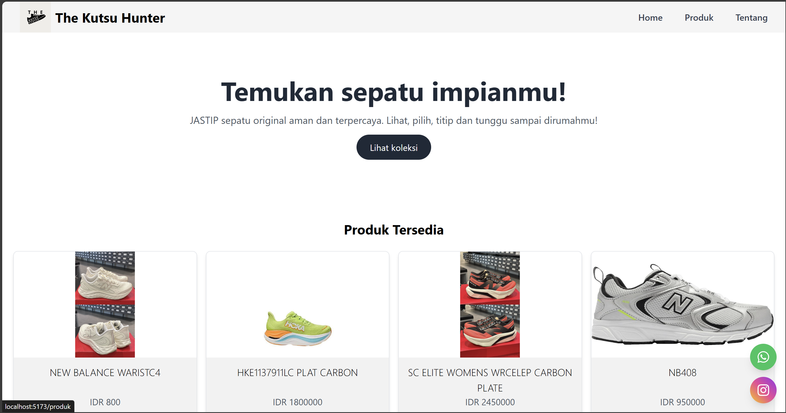
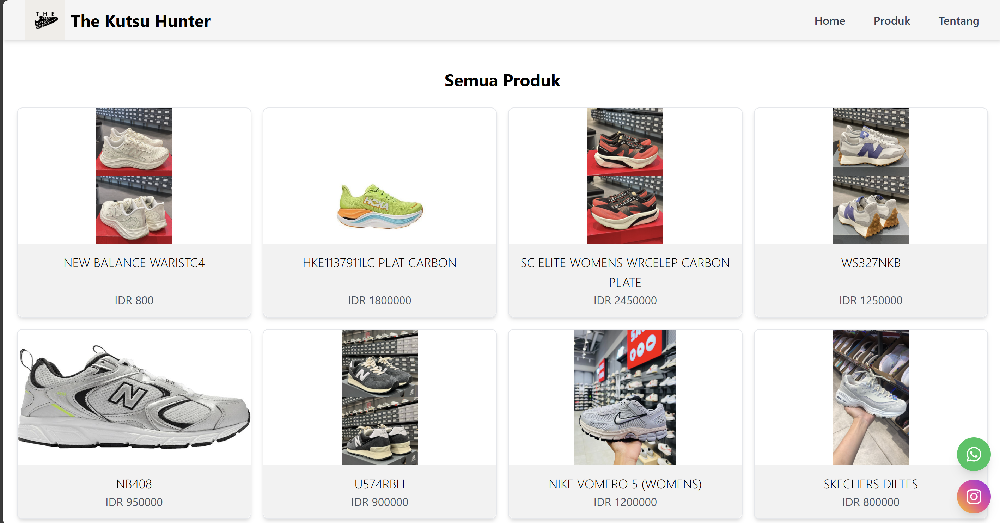
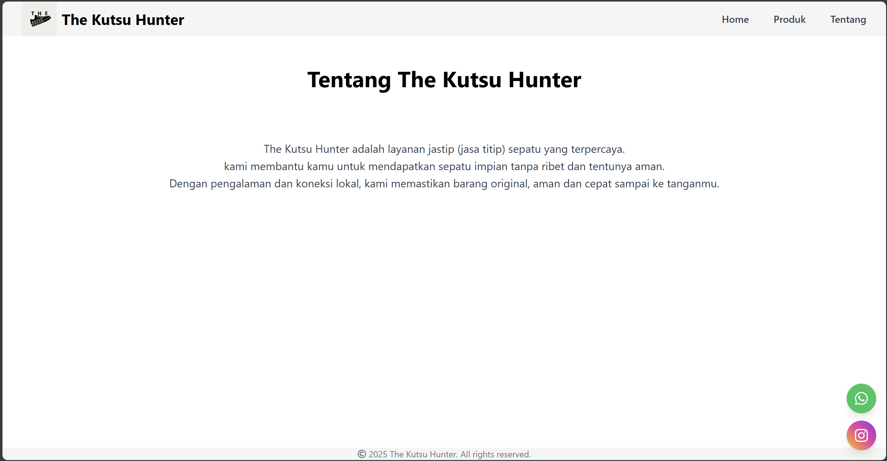

# The Kutsu Website

A full-stack web application for "The Kutsu Hunter" sneaker shopping service.  
Frontend is built with React and Vite, backend with Node.js, Express, and MySQL.  
Users can browse products, see detailed product pages, and leave reviews. Admins can manage products and reviews.

# Features
- Display a list of sneaker products  
- Product detail page with user reviews  
- Review submission form connected to MySQL database  
- Admin dashboard for product and review management (CRUD)  
- API backend connecting frontend to database  
- Responsive design for desktop and mobile

# Tech Stack
- **Frontend:** React, Vite  
- **Styling:** Tailwind CSS (or your CSS framework)  
- **Backend:** Node.js, Express  
- **Database:** MySQL

# Screenshots

**Home page**

**Product**

**About**

# Installation
1. Clone the repository: git clone https://github.com/aldiipr/thekutsu-web.git

2. Set backend: cd backend && npm install

3. Set frontend: cd ../frontend && npm install

4. Run the project:
    - Backend: npm start
    - Frontend: npm run dev

# Live Demo
Coming soon

# Author
Developer by Aldi Priono (https://github.com/aldiipr)